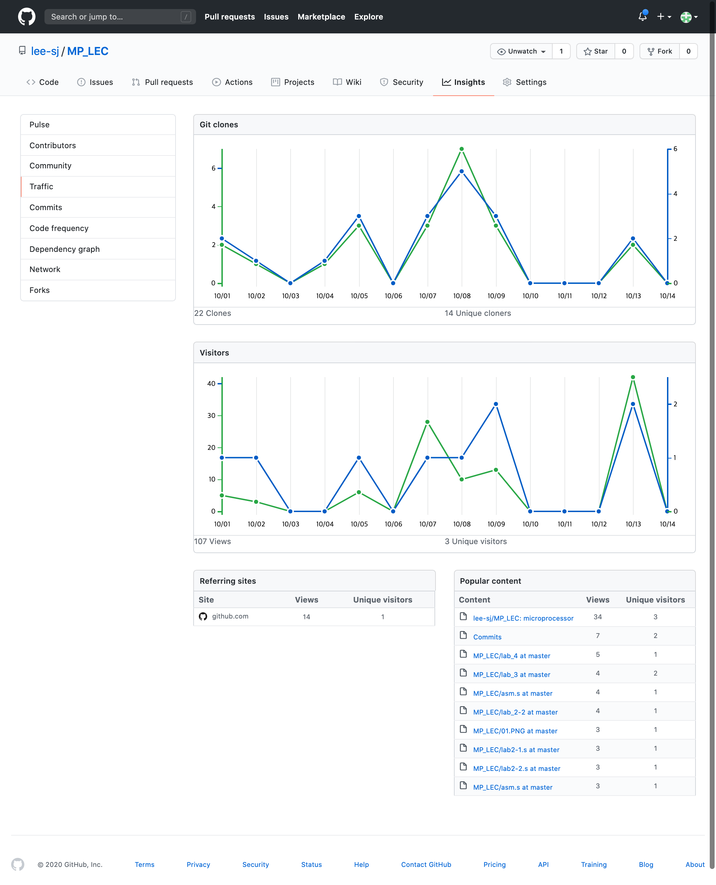

워크스페이스는 매번 다시 만들어서 시작  

1. lab 폴더 생성 - 네이밍 : lab_x  
2. 프로젝트 폴더생성 - 네이밍 : labx-x 
3. File > New > workspace  
4. project > Create New Project - 네이밍 : labx-x

10월 14일 아래 이미지와 같이 clone 하는 사람들이 많아져서 업데이트를 중지하거나 private 으로 변경 예정

